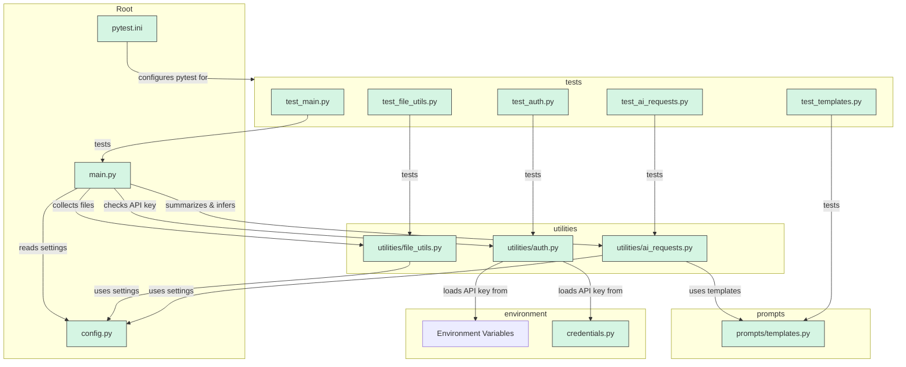

# Automated Diagram Generator via Mermaid and AI

## MermaidJS Diagram - Generated via Automation

```mermaid
%%{init: {"theme":"default"}}%%
graph TD
  subgraph "Root"
    CP[config.py]
    MP[main.py]
    PN[pytest.ini]
  end
  subgraph "utilities"
    PUU[utilities/file_utils.py]
    UAU[utilities/auth.py]
    AUR[utilities/ai_requests.py]
  end
  subgraph "prompts"
    PT[prompts/templates.py]
  end
  subgraph "environment"
    EV[Environment Variables]
    CR[credentials.py]
  end
  subgraph "tests"
    TM1[test_main.py]
    TM2[test_file_utils.py]
    TM3[test_auth.py]
    TM4[test_ai_requests.py]
    TM5[test_templates.py]
  end

  MP -->|reads settings| CP
  MP -->|collects files| PUU
  MP -->|checks API key| UAU
  MP -->|summarizes & infers| AUR

  PUU -->|uses settings| CP
  UAU -->|loads API key from| EV
  UAU -->|loads API key from| CR
  AUR -->|uses settings| CP
  AUR -->|uses templates| PT

  TM1 -->|tests| MP
  TM2 -->|tests| PUU
  TM3 -->|tests| UAU
  TM4 -->|tests| AUR
  TM5 -->|tests| PT

  PN -->|configures pytest for| tests

  classDef file fill:#d5f5e3,stroke:#333,color:#333
  class CP,MP,PN,PUU,UAU,AUR,PT,CR,TM1,TM2,TM3,TM4,TM5 file
```
<!-- END AUTOMATED MERMAID -->
