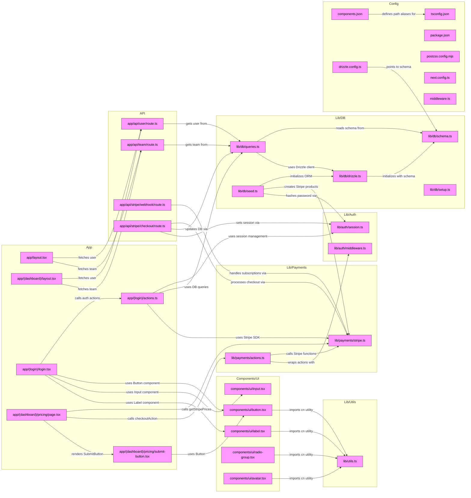

```mermaid
%%{init: {"theme":"default","themeVariables":{"edgeLabelBackground":"#fff"}}}%%
graph LR
subgraph App
  app_layout["app/layout.tsx"]
  dash_layout["app/(dashboard)/layout.tsx"]
  login_actions["app/(login)/actions.ts"]
  app_login["app/(login)/login.tsx"]
  pricing_page["app/(dashboard)/pricing/page.tsx"]
  submit_button["app/(dashboard)/pricing/submit-button.tsx"]
end
subgraph API
  user_route["app/api/user/route.ts"]
  team_route["app/api/team/route.ts"]
  stripe_webhook["app/api/stripe/webhook/route.ts"]
  stripe_checkout["app/api/stripe/checkout/route.ts"]
end
subgraph "Components/UI"
  btn["components/ui/button.tsx"]
  input["components/ui/input.tsx"]
  label["components/ui/label.tsx"]
  radio["components/ui/radio-group.tsx"]
  avatar["components/ui/avatar.tsx"]
end
subgraph "Lib/Auth"
  session["lib/auth/session.ts"]
  middleware_auth["lib/auth/middleware.ts"]
end
subgraph "Lib/DB"
  schema["lib/db/schema.ts"]
  drizzle_instance["lib/db/drizzle.ts"]
  queries["lib/db/queries.ts"]
  setup_db["lib/db/setup.ts"]
  seed["lib/db/seed.ts"]
end
subgraph "Lib/Utils"
  utils["lib/utils.ts"]
end
subgraph "Lib/Payments"
  stripe_module["lib/payments/stripe.ts"]
  payments_actions["lib/payments/actions.ts"]
end
subgraph Config
  tsconfig["tsconfig.json"]
  package_json["package.json"]
  postcss["postcss.config.mjs"]
  components_json["components.json"]
  drizzle_conf["drizzle.config.ts"]
  next_config["next.config.ts"]
  middleware_root["middleware.ts"]
end

app_layout -->|fetches user| user_route
app_layout -->|fetches team| team_route
dash_layout -->|fetches user| user_route
dash_layout -->|fetches team| team_route

login_actions -->|uses session management| session
login_actions -->|uses DB queries| queries
login_actions -->|uses Stripe SDK| stripe_module

app_login -->|calls auth actions| login_actions
app_login -->|uses Button component| btn
app_login -->|uses Input component| input
app_login -->|uses Label component| label

pricing_page -->|calls getStripePrices| stripe_module
pricing_page -->|calls checkoutAction| payments_actions
pricing_page -->|renders SubmitButton| submit_button

submit_button -->|uses Button| btn

stripe_webhook -->|handles subscriptions via| stripe_module
stripe_checkout -->|processes checkout via| stripe_module
stripe_checkout -->|updates DB via| queries
stripe_checkout -->|sets session via| session

user_route -->|gets user from| queries
team_route -->|gets team from| queries

btn -->|imports cn utility| utils
label -->|imports cn utility| utils
radio -->|imports cn utility| utils
avatar -->|imports cn utility| utils

queries -->|reads schema from| schema
queries -->|uses Drizzle client| drizzle_instance
drizzle_instance -->|initializes with schema| schema

drizzle_conf -->|points to schema| schema

seed -->|initializes ORM| drizzle_instance
seed -->|creates Stripe products| stripe_module
seed -->|hashes password via| session

payments_actions -->|calls Stripe functions| stripe_module
payments_actions -->|wraps actions with| middleware_auth

components_json -->|defines path aliases for| tsconfig

classDef file fill:#f9f,stroke:#333,color:#000
class app_layout,dash_layout,login_actions,app_login,pricing_page,submit_button,user_route,team_route,stripe_webhook,stripe_checkout,btn,input,label,radio,avatar,session,middleware_auth,schema,drizzle_instance,queries,setup_db,seed,utils,stripe_module,payments_actions,tsconfig,package_json,postcss,components_json,drizzle_conf,next_config,middleware_root file
```